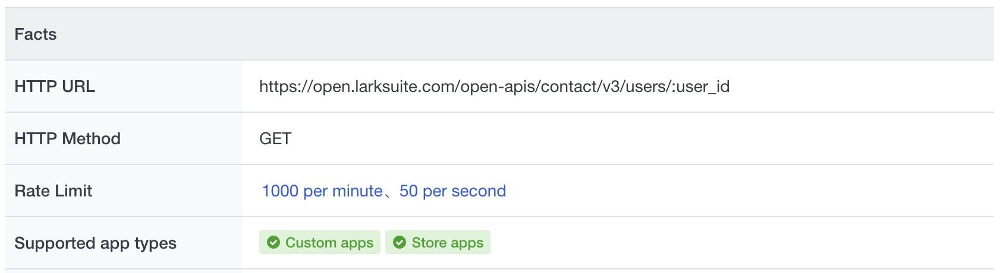
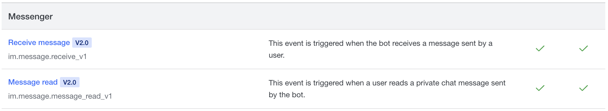

# Feishu Open API SDK
To help developers more conveniently use Feishu's open capabilities to develop applications and simplify the steps when accessing the Feishu open platform, the open platform provides a unified server-side SDK. Developers can use this SDK to quickly develop features and improve development efficiency.

## Installation
```shell
pip install lark-oapi -U
```
This library requires Python 3.6 and above.

## Simple Example
```python
import lark_oapi as lark

# create client
client = lark.Client.builder().app_id("APP_ID").app_secret("APP_SECRET").build()

# construct request object  
request = lark.contact.v3.GetUserRequest.builder().user_id("7be5fg9a").build()

# send request
response = client.contact.v3.user.get(request)
```
For more examples, refer to：[Request Examples](./samples/api)

## API Client
Before calling the API, you need to create an API Client, and then you can initiate API calls based on the API Client.

### Create Client
- Self-built application
```python
import lark_oapi as lark

client = lark.Client.builder() \
    .app_id("APP_ID") \
    .app_secret("APP_SECRET") \
    .build()
```

- Store application
```python
import lark_oapi as lark

client = lark.Client.builder() \
    .app_id("APP_ID") \
    .app_secret("APP_SECRET") \
    .app_type(lark.AppType.ISV) \
    .build()
```

### Client Configuration Options
When creating an API Client, you can configure it with various options, such as setting the log level and HTTP request timeout.

```python
import lark_oapi as lark

client = lark.Client.builder() \
    .app_id("APP_ID") \
    .app_secret("APP_SECRET") \
    .domain(lark.FEISHU_DOMAIN) \       # Domain, default is https://open.feishu.cn
    .timeout(3) \                       # Client timeout (in seconds), default is no timeout
    .app_type(lark.AppType.ISV) \       # Application type, default is self-built application; if set to ISV, you need to configure tenant_key in request_option
    .app_ticket("xxxx") \               # Obtain app_access_token credential, needs to be configured when app_type = ISV
    .enable_set_token(False) \          # Whether to allow manual setting of token, default is disabled; if enabled, you need to configure the token in request_option
    .cache(Cache()) \                   # Custom cache, default is to use the built-in local cache
    .log_level(lark.LogLevel.DEBUG) \   # Log level, default is WARNING
    .build()
```

## API Call
After creating the API Client, you can use `client.<business_domain>.<version>.<resource>.<method_name>` to locate a specific API method, and then initiate a call to that API.



For a list of all APIs available on the Feishu open platform, click[here](https://open.larksuite.com/document/server-docs/getting-started/server-api-list)

### Basic Usage
In the following example, we use the client to call API to [get User ID by phone number or email](https://open.larksuite.com/document/server-docs/contact-v3/user/batch_get_id)

```python
# Code generated by Lark OpenAPI.

import lark_oapi as lark
from lark_oapi.api.contact.v3 import *


client = lark.Client.builder() \
    .app_id("APP_ID") \
    .app_secret("APP_SECRET") \
    .log_level(lark.LogLevel.DEBUG) \
    .build()

# construct request object
request: BatchGetIdUserRequest = BatchGetIdUserRequest.builder() \
    .user_id_type("open_id") \
    .request_body(BatchGetIdUserRequestBody.builder()
                  .emails(["xxxx@bytedance.com"])
                  .mobiles(["15000000000"])
                  .build()) \
    .build()

# send request
response: BatchGetIdUserResponse = client.contact.v3.user.batch_get_id(request)

# handle failed response
if not response.success():
    lark.logger.error(
        f"client.contact.v3.user.batch_get_id failed, code: {response.code}, msg: {response.msg}, log_id: {response.get_log_id()}")

# process result
lark.logger.info(lark.JSON.marshal(response.data, indent=4))
```
For more examples, refer to：[Request Examples](./samples/api)

### Request Configuration Options
When making each API call, you can set some request-level parameters, such as passing userAccessToken, custom headers, etc.

```python
import lark_oapi as lark
from lark_oapi.api.contact.v3 import *

# create client
import lark_oapi as lark
from lark_oapi.api.contact.v3 import *

client = lark.Client.builder() \
    .enable_set_token(True) \
    .log_level(lark.LogLevel.DEBUG) \
    .build()

# construct request object
request: BatchGetIdUserRequest = BatchGetIdUserRequest.builder() \
    .user_id_type("open_id") \
    .request_body(BatchGetIdUserRequestBody.builder()
                  .emails(["xxxx@bytedance.com"])
                  .mobiles(["15000000000"])
                  .build()) \
    .build()

# set request options
headers = {"key1": "value1", "key2": "value2"}
req_opt = lark.RequestOption.builder()\
    .tenant_access_token("t-g1047hjTXIZKCBFYWXUCK3D2LJWZYCWYL7USXXXX")\
    .headers(headers)\
    .build()

# send request
response: BatchGetIdUserResponse = client.contact.v3.user.batch_get_id(request, req_opt)

# handle falied response
if not response.success():
    lark.logger.error(
        f"client.contact.v3.user.batch_get_id failed, code: {response.code}, msg: {response.msg}, log_id: {response.get_log_id()}")

# process result
lark.logger.info(lark.JSON.marshal(response.data, indent=4))
```

As shown above, use the Builder pattern of RequestOptions to construct request-level parameters. The following table shows all the options that can be set:

<table>
  <thead align=left>
    <tr>
      <th>
        Configuration Options
      </th>
       <th>
        Description
      </th>
    </tr>
  </thead>
  <tbody align=left valign=top>
    <tr>
      <th>
        <code>tenant_key</code>
      </th>
      <td>Tenant key, must be set for store applications.</td>
    </tr>
    <tr>
      <th>
        <code>user_access_token</code>
      </th>
      <td>User token, `enable_set_token` must be set to `True` when creating the client.</td>
    </tr>
    <tr>
      <th>
        <code>tenant_access_token</code>
      </th>
      <td>Tenant token, `enable_set_token` must be set to `True` when creating the client.</td>
    </tr>
    <tr>
      <th>
        <code>app_access_token</code>
      </th>
      <td>App token, `enable_set_token` must be set to `True` when creating the client.</td>
    </tr>
    <tr>
      <th>
        <code>headers</code>
      </th>
      <td>Custom request headers, these headers will be passed through to the Feishu open platform server.</td
    </tr>
  </tbody>
</table>

### Native Method Call
Some older version APIs do not have metadata information, so the corresponding SDK models cannot be generated and need to be called using the native method.

In the following example, the client uses native method call to [get User ID by phone number or email](https://open.larksuite.com/document/server-docs/contact-v3/user/batch_get_id) API.

```python
import lark_oapi as lark


# create client
client = lark.Client.builder() \
    .app_id("APP_ID") \
    .app_secret("APP_SECRET") \
    .log_level(lark.LogLevel.DEBUG) \
    .build()

# construct request object
request: lark.BaseRequest = lark.BaseRequest.builder() \
    .http_method(lark.HttpMethod.POST) \
    .uri("/open-apis/contact/v3/users/batch_get_id") \
    .token_types({lark.AccessTokenType.TENANT}) \
    .queries([("user_id_type", "open_id")]) \
    .body({"emails": ["xxxx@bytedance.com"], "mobiles": ["15000000000"]}) \
    .build()

# send request
response: lark.BaseResponse = client.request(request)

# handle failed response
if not response.success():
    lark.logger.error(
        f"client.request failed, code: {response.code}, msg: {response.msg}, log_id: {response.get_log_id()}")

# process result
lark.logger.info(str(response.raw.content, lark.UTF_8))
```
For more examples, refer to：[Native Method Call](samples/api/raw.py)

## Handling Message Event Callbacks
To learn more about message subscriptions, you can [click here](https://open.larksuite.com/document/server-docs/event-subscription/overview-of-event-subscription)

To get a list of all events available on the Feishu open platform, you can [click here](https://open.larksuite.com/document/server-docs/event-subscription/event-list)
### Basic Usage
After subscribing to message events, you can use the following code to handle message events pushed by the Feishu open platform.

In the example below, Flask is used to start the HTTP server. If you are using another web framework, just handle the HTTP input and output parameters accordingly.

```python
from flask import Flask

import lark_oapi as lark
from lark_oapi.adapter.flask import *
from lark_oapi.api.im.v1 import *

app = Flask(__name__)


def do_p2_im_message_receive_v1(data: P2ImMessageReceiveV1) -> None:
    print(lark.JSON.marshal(data))


def do_customized_event(data: lark.CustomizedEvent) -> None:
    print(lark.JSON.marshal(data))


handler = lark.EventDispatcherHandler.builder(lark.ENCRYPT_KEY, lark.VERIFICATION_TOKEN, lark.LogLevel.DEBUG) \
    .register_p2_im_message_receive_v1(do_p2_im_message_receive_v1) \
    .register_p1_customized_event("Enter the key of the event you want to subscribe to, for example, out_approval", do_customized_event) \
    .build()


@app.route("/event", methods=["POST"])
def event():
    resp = handler.do(parse_req())
    return parse_resp(resp)


if __name__ == "__main__":
    app.run(port=7777)
```
The `EventDispatcherHandler.builder(encrypt_key: str, verification_token: str)` method parameters are used for signature verification and message decryption. You can find these in the [Developer Console](https://open.larksuite.com/app?lang=en-US) under "Event Subscriptions".


When registering a handler, such as using `register_p2_im_message_receive_v1` to register a message receive event callback, note that `p2` indicates the message protocol version. Currently, the Feishu open platform supports [two message protocols](https://open.larksuite.com/document/server-docs/event-subscription/overview-of-event-subscription): version `1.0` and version `2.0`.

As shown below, when you register a message handler, you need to check the [event list](https://open.larksuite.com/document/server-docs/event-subscription/event-list) to see which protocol version of the event you need.

If the message protocol is version `1.0`, you need to find handlers that start with `register_p1_xxxx` when registering the handler. If the message protocol is version `2.0`, you need to find handlers that start with `register_p2_xxxx` when registering the handler.

If you cannot find the handler in the SDK, you can use `register_p1_customized_event` or `register_p2_customized_event` to register a custom event.



For more examples, refer to: [Event Callbacks](samples/event)

## Handling Card Action Callbacks
For more information about card actions, you can click [here](https://open.larksuite.com/document/common-capabilities/message-card/introduction-of-message-cards)

### Basic Usage
You can use the following code to handle card action callbacks. In the example below, Flask is used to start the HTTP server. If you are using another web framework, just handle the HTTP input and output parameters accordingly.

```python
from typing import Any

from flask import Flask

import lark_oapi as lark
from lark_oapi.adapter.flask import *

app = Flask(__name__)


def do_interactive_card(data: lark.Card) -> Any:
    print(lark.JSON.marshal(data))
    content = {
        "header": {
            "title": {
                "tag": "plain_text",
                "content": "Card updated successfully"
            },
            "template": "green"
        },
        "elements": [
            {
                "tag": "div",
                "text": {
                    "tag": "lark_md",
                    "content": "**Success!\n成功啦😄**"
                }
            },
        ]
    }
    return content


handler = lark.CardActionHandler.builder(lark.ENCRYPT_KEY, lark.VERIFICATION_TOKEN, lark.LogLevel.DEBUG) \
    .register(do_interactive_card) \
    .build()


@app.route("/card", methods=["POST"])
def card():
    resp = handler.do(parse_req())
    return parse_resp(resp)


if __name__ == "__main__":
    app.run(port=7777)

```

For more examples, refer to：[Event Callbacks](samples/card)

## Extended Examples
We have also encapsulated common API combinations and business scenario examples based on the SDK, such as:
* Messages
  * [Send file message](https://github.com/larksuite/oapi-sdk-python-demo/blob/main/composite_api/im/send_file.py)
  * [Send image message](https://github.com/larksuite/oapi-sdk-python-demo/blob/main/composite_api/im/send_image.py)
* Contacts
  * [Get list of all users in a department](https://github.com/larksuite/oapi-sdk-python-demo/blob/main/composite_api/contact/list_user_by_department.py)
* Tables
  * [Create tables](https://github.com/larksuite/oapi-sdk-python-demo/blob/main/composite_api/base/create_app_and_tables.py)
* Spreadsheets
  * [Copy and paste cell data within a range](https://github.com/larksuite/oapi-sdk-python-demo/blob/main/composite_api/sheets/copy_and_paste_by_range.py)
  * [Download all media in a specified cell range](https://github.com/larksuite/oapi-sdk-python-demo/blob/main/composite_api/sheets/download_media_by_range.py)
* Tutorials
  * [Bot auto-joins group for alerts](https://github.com/larksuite/oapi-sdk-python-demo/blob/main/quick_start/robot) ([Development Tutorial](https://open.feishu.cn/document/home/message-development-tutorial/introduction?lang=en-US))

For more examples, refer to：https://github.com/larksuite/oapi-sdk-python-demo

## License
MIT

## Join the Discussion Group
[_Click here_](https://applink.feishu.cn/client/chat/chatter/add_by_link?link_token=575k28fa-2c12-400a-80c0-2d8924e00d38)or scan the QR code to join the discussion group.


